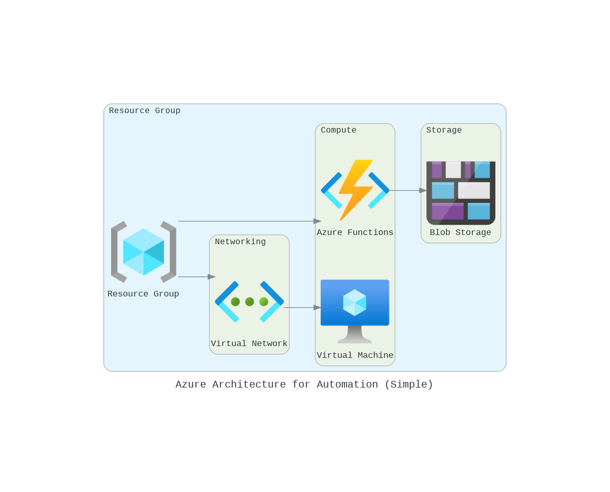
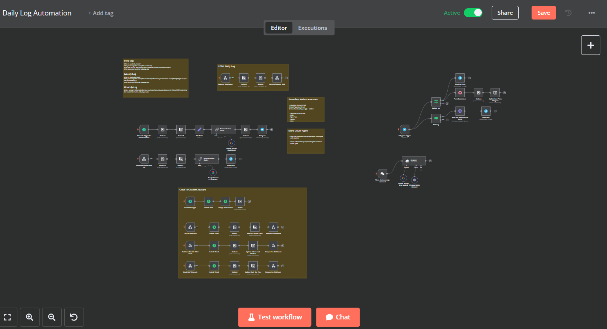

# Azure Cloud Automation for AI-Powered Log Management

This project demonstrates an automated log management solution built on **Azure Cloud**, using **Virtual Machines (VM)** and **Azure Functions** to automate log summarization and management. It showcases my ability to design scalable cloud architectures and integrate cloud services effectively.

### Key Features:

- **VM** hosts **N8N** for orchestrating workflows.
- **Azure Functions** automates log summarization and website updates via **Puppeteer**.
- **Blob Storage** is used for persistent log/Snapshot storage.
- Resources are connected securely via **Virtual Network** and managed under a **Resource Group**.

### Key Technologies:

- **Azure Cloud Services**: Virtual Machine (VM), Functions, Blob Storage
- **Web App**: N8N (Low-code automation)
- **Libraries**: Puppeteer

### Impact:

- **70% reduction in manual effort** for log management and updates.
- Scalable and cost-efficient solution leveraging Azure's cloud services.

This project demonstrates my proficiency in **cloud automation**, **Azure architecture**, and integration of **low-code platforms**

Most Important, this solution contributed a lot in writing log "efficiently":P
